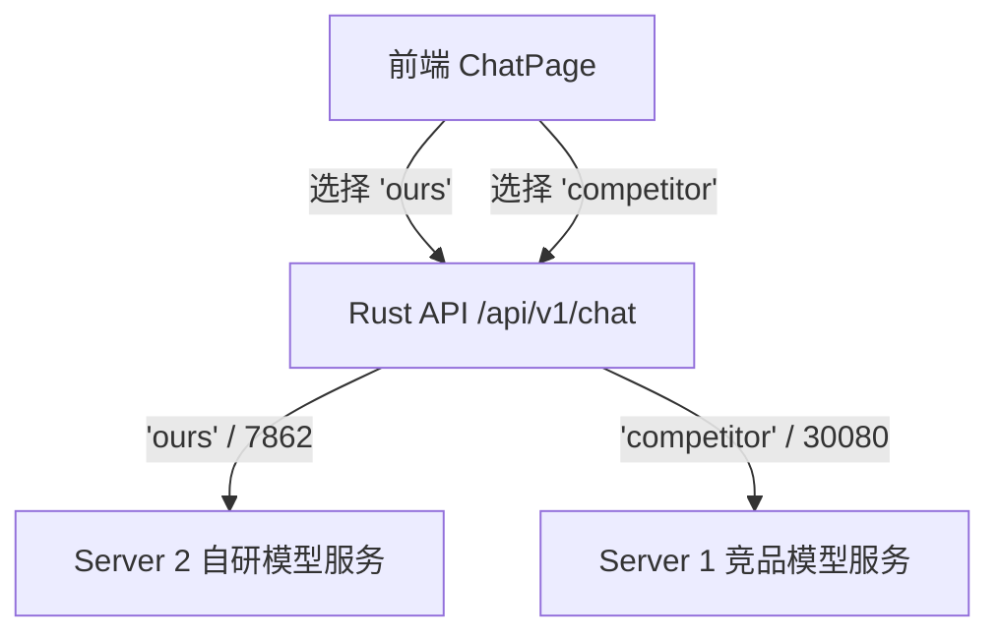

# 双模型切换及语音服务（TTS）问题修复技术文档

本文件记录了招生问答系统中**双模型在线切换的架构实现**、**语音播报（TTS）两大核心故障的定位与修复过程**，以及后续**向单模型上线过渡时的操作指引**。

---

## 一、 双模型在线切换（Dual-Model Switching）设计

系统实现了在前端界面一键切换“我方自研”与“对方竞品”模型，并将对应的请求路由到不同后端接口的完整流程。

### 1. 架构流向示意图



### 2. 前端实现
*   **状态控制**：在 [page.tsx](file:///Users/scm/code/rust_enrollment/apps/web/app/chat/page.tsx) 中定义了 `selectedModel` 状态（值可选 `"ours"` 或 `"competitor"`）。
*   **切换组件**：在顶部 Header 区域添加了切换按钮组，带有当前活跃状态的呼吸灯提示点。
*   **会话请求**：[use-chat-session.ts](file:///Users/scm/code/rust_enrollment/apps/web/components/use-chat-session.ts) 会在发送请求时，自动将 `model` 字段封装进 `ChatRequest` 荷载。

### 3. 后端路由
*   后端 Rust 服务在解析请求时提取 `model` 字段。
*   如果 `model` 值为 `"competitor"`，请求将被导流至由 ssh 隧道转发的 Server 1（对应本地转发端口 `30080`）。
*   若值为 `"ours"` 或缺省，则默认走 Server 2（端口 `7862`）的自研模型服务。

---

## 二、 语音播放服务（TTS）问题修复记录

在双模型部署及优化过程中，语音播报服务遇到了两个严重的阻塞级故障，均已成功定位并彻底解决。

### 故障 1：语音卡死在“正在连接/播报中”但没有声音（Session Superseded 竞态）

#### 1. 故障表现
*   数字人头像上显示“语音播报中”或“语音正在连接”。
*   前端浏览器控制台**没有**输出 `[PCMAudioPlayer] pushPCM: received XXX bytes` 的接收字节日志。
*   后台 Rust 服务的 TTS 任务（`stream_tts_segment`）显示已正常合成并向 WebSocket 发送了大量音频数据。

#### 2. 原因定位
在 [page.tsx](file:///Users/scm/code/rust_enrollment/apps/web/app/chat/page.tsx) 的消息提交函数 `submit` 中，为绕过浏览器自动播放策略（Autoplay Restriction），我们在用户手势同步调用栈中创建播放器：
```typescript
// 错误顺序：先初始化，后打断
void voice.prepare(); 
if (voice.usesServerVoice) {
  void voice.interrupt(); // 同步调用打断
}
```
*   `voice.prepare()` 异步地启动了播放器连接流程，在宏任务/微任务中等待连接。
*   紧接着**同步执行**了 `voice.interrupt()`。`interrupt()` 内部会将全局会话计数器 `sessionRunId.current` **自增**（如从 `1` 变为 `2`）。
*   当异步的 `prepare` 终于执行完毕并检查会话是否有效时，发现当前 `sessionRunId.current (2)` 与启动时的 `runId (1)` 不一致，触发了 **`"TTS session superseded"`（会话被覆盖）** 保护机制。
*   这导致刚刚初始化成功的播放器立刻被 `stop()` 销毁，`sessionPrepared.current` 永远变回了 `false`。
*   之后收到的所有音频数据均卡在 `playAudioChunk` 的未就绪等待队列中，无法播发。

#### 3. 修复方案
将逻辑调整为**“先完全打断、再开始准备”**：
```typescript
// 正确顺序：先清除旧会话，再在用户手势中同步开启新连接
if (voice.usesServerVoice) {
  stopActiveVoiceStream();
}
void voice.interrupt();
void voice.prepare();
```
保证了 `prepare()` 启动的新会话 ID 永远处于最新且匹配的状态，避免被自己刚刚发起的打断行为所覆盖。

---

### 故障 2：香港公网访问时提示“语音暂不可用”（Secure Context 安全上下文限制）

#### 1. 故障表现
*   本地 `localhost:3000` 访问时，语音播放百分之百正常。
*   通过香港公网 HTTP 协议访问 `http://cpa.abolian.online/chat` 时，数字人左上角立即亮起红色 **“语言暂不可用”**。

#### 2. 原因定位
*   自研流式语音模式（`server-voice`）通过 `AudioWorklet` 处理 PCM 裸流。
*   **安全规范限制**：现代主流浏览器规定，**`AudioWorklet` (Web Audio API 核心组件) 是一项仅限于“安全上下文（Secure Context）”使用的特性**。
*   当用户使用不安全的 `http://` 访问域名时，浏览器在安全沙箱中会直接将 `audioContext.audioWorklet` 设为 `undefined`。
*   当代码执行 `if (!this.audioContext.audioWorklet)` 时抛出 `AudioWorklet not supported` 错误，从而使整个语音模块报错并不可用。

#### 3. 修复方案
在线上前端的 `ChatPage` 中添加了**自动升级 HTTPS** 的策略：
```typescript
useEffect(() => {
  if (
    typeof window !== "undefined" &&
    window.location.protocol === "http:" &&
    window.location.hostname !== "localhost" &&
    window.location.hostname !== "127.0.0.1"
  ) {
    // 将不安全的 http 自动替换为安全加密的 https 访问
    window.location.replace(
      `https://${window.location.hostname}${window.location.pathname}${window.location.search}`
    );
  }
}, []);
```
系统由于已经配置了 Cloudflare 的 HTTPS 代理，此修改强制用户走安全通道，一劳永逸地解决了因非安全上下文导致的 `AudioWorklet` 被禁用的问题。

---

## 三、 单模型上线过渡指南

当决定将系统切换为单一模型正式上线，且不再需要保留双模型切换按钮时，请按照以下步骤进行调整（**建议仅修改配置或通过代码开关隐藏，以便未来需要时快速恢复**）。

### 1. 隐藏前端切换开关
若想在前台对用户隐藏切换开关，建议不要直接删除代码，而是在 [page.tsx](file:///Users/scm/code/rust_enrollment/apps/web/app/chat/page.tsx) 中直接把切换 UI 部分注释掉或通过开关控制。
定位至 `page.tsx` 中渲染切换组的组件：
```tsx
{/* 找到自研/竞品模型切换控制，将其隐藏，并固定 selectedModel 为所选的上线模型 */}
{/* 
<div className="flex items-center gap-1.5 rounded-xl bg-slate-100 p-1 border border-slate-200/50">
  ...
</div> 
*/}
```

### 2. 固定默认上线模型
将 `selectedModel` 的初始状态固定为您需要上线的模型值（如自研模型 `"ours"` 或竞品模型 `"competitor"`）：
```typescript
// 修改前
const [selectedModel, setSelectedModel] = useState<string>("ours");

// 修改后（如果要固定自研模型）
const selectedModel = "ours"; // 或者 "competitor"
```
这样即便不提供切换按钮，向后端发送的所有请求也会默认且唯一地携带该模型标识。

### 3. 后端固定逻辑（备用）
若不想依赖前端传递的模型参数，可以直接在后端 Rust 服务的 `apps/api/src/main.rs` 处理请求的入口处强行重写模型值，将其绑定为指定的后端服务。
